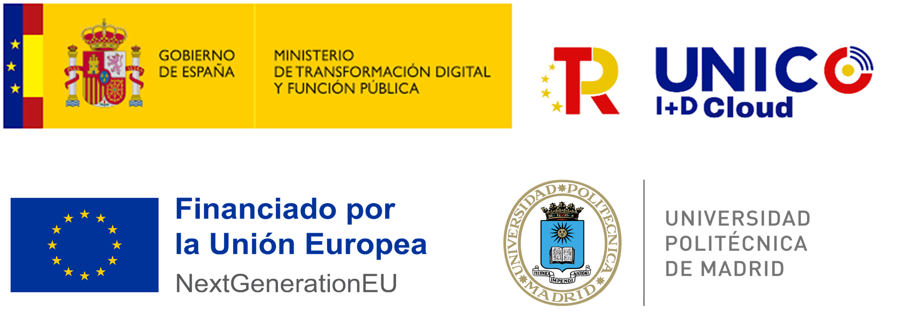

# SHACL Generator Scripts
Command line SHACL shapes generator from OWL ontologies. It is based on the RDFlib library, which supports multiple serializations of OWL ontologies and SPARQL queries.

## To run the application:
1. Make sure you have Python 3 installed.
2. Clone the current repository.
3. Navigate to the folder containing the `requirements.txt` file.
4. Run `pip install -r requirements.txt`.
5. You should be able to run the `construct_shacl.py` command line app as described below.

_The application provided was developed using Python version 3.10.12_

## Usage
To use this application you can run the entrypoint script `construct_shacl.py` as follows: 
```bash
$ python3 construct_shacl.py [-h] [-v vocabulary annotation] [-p prefix] <ontology> <shapes> <target> <subset_properties>
```

### Positional Arguments
    
    *  <ontology>           path to OWL ontology input file
    *  <shapes>             path to SHACL shapes output file
    *  <target>             target class name (without any prefix or namespace)
    *  <subset_properties>  target subset properties ('datatype_properties',  'object_properties' or 'skos_in_scheme')

_The fields marked with an \* are mandatory._

In case you want a customized output, feel free to modify the template files. In addition, the application generates a set of queries available to construct shapes directly from an ontology endpoint. 


### Example
```bash
$ python3 construct_shacl.py path/to/input/ontology.ttl path/to/output/shapes.ttl TargetClassName datatype_properties
```


### skos_in_scheme example
```bash
$ python3 construct_shacl.py -p ex -v path/to/input/SKOSvocabulary.ttl ex:inSkosConceptScheme path/to/input/ontology.ttl path/to/output/shapes.ttl TargetClassName skos_in_scheme
```
To generate SHACL shapes for properties pointing to `skos:Concept` instances the SKOS vocabulary provided should connect its concepts to schemes. In addition, the ontology provided must be annotated with a given property that should point to a `skos:ConceptScheme` instance of the vocabulary.

## Options
The optional arguments are the following:

    -h, --help            show this help message and exit
    -v, --vocabulary      path to SKOS vocabulary input file and the inScheme
                          ontology annotation property used (with prefix)
    -p, --prefix          preferred namespace prefix (ns is the default value)

## Acknowledgement
"Este trabajo ha recibido financiación del proyecto INESData (Infraestructura para la INvestigación de ESpacios de DAtos distribuidos en UPM), un proyecto financiado en el contexto de la convocatoria UNICO I+D CLOUD del Ministerio para la Transformación Digital y de la Función Pública en el marco del PRTR financiado por Unión Europea (NextGenerationEU)“

This work has received funding from the INESData project (Infrastructure to Investigate Data Spaces in Distributed Environments at UPM), a project funded under the UNICO I+D CLOUD call by the Ministry for Digital Transformation and the Civil Service, within the framework of the recovery plan PRTR financed by the European Union (NextGenerationEU)

<p align="center">
  
</p>